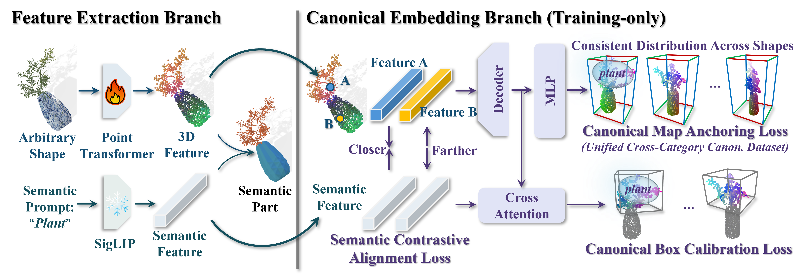

# CoSMo3D: Open-World Promptable 3D Semantic Segmentation through LLM-Guided Canonical Spatial Modeling

**CVPR 2026 — Full Score**

Open-world promptable 3D semantic segmentation remains brittle as semantics are inferred in the input sensor coordinates. Yet humans interpret parts via functional roles in a canonical space – wings extend laterally, handles protrude to the side, and legs support from below. To fill this gap, we propose **CoSMo3D**, which attains canonical space perception by inducing a latent canonical reference frame learned directly from data. By construction, we create a unified canonical dataset through LLM-guided intra- and cross-category alignment, exposing canonical spatial regularities across 200 categories. By induction, we realize canonicality through a dual-branch architecture with canonical map anchoring and canonical box calibration, collapsing pose variation and symmetry into a stable canonical embedding. This shift from input pose space to canonical embedding yields far more stable and transferable part semantics. CoSMo3D establishes new state of the art in open-world promptable 3D segmentation.

---

## Todo List

- [ ] Release example test & training models
- [ ] Release all test datasets and corresponding test code
- [ ] Release training code and training datasets
